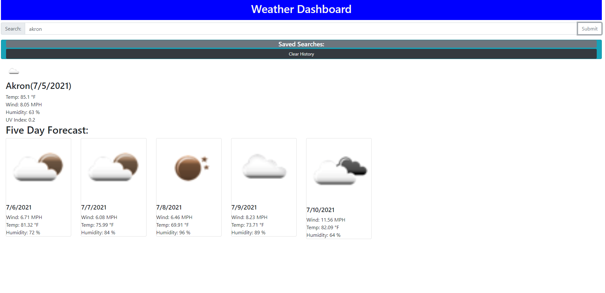

# weather-dashboard
When you type in the city that you want it will give you the current forcast. It includes an icon, city name, date, temperture, wind speed, humidity, and the UV Index. Then below that you are presented with the five day forcast. This includes the icon, date, wind speed, temperture, and humidity.
